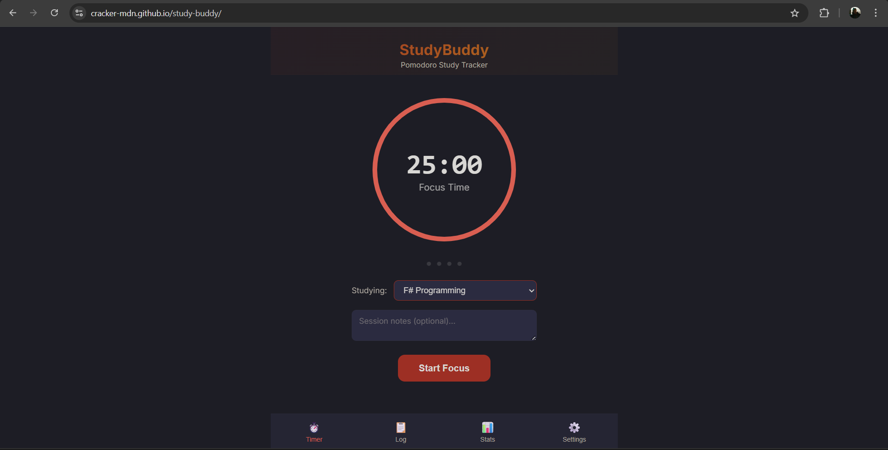
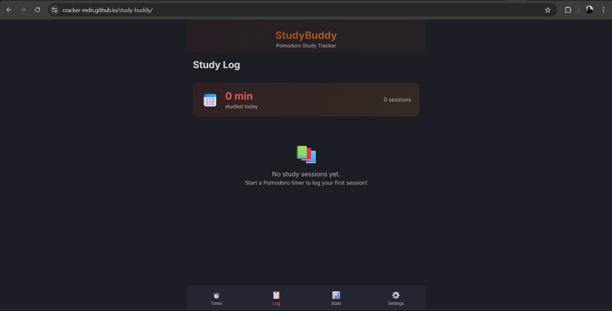
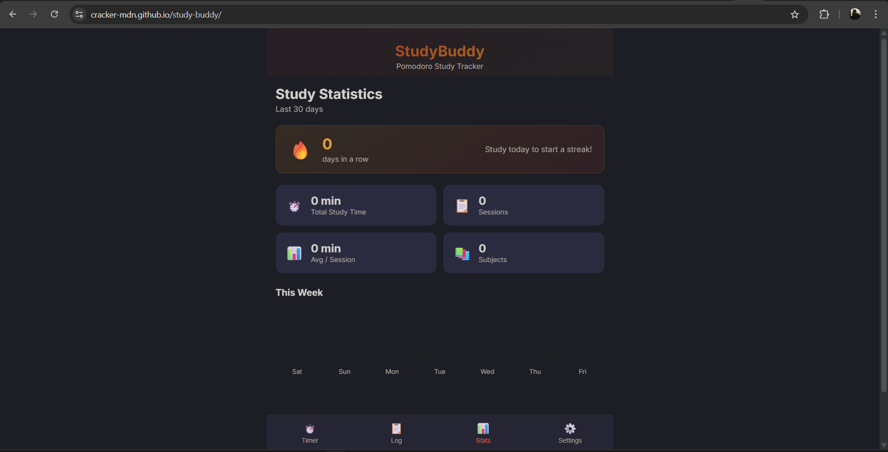

# StudyBuddy — Pomodoro Study Tracker

A client-side web application for university students to track focused study sessions using the Pomodoro Technique. Built entirely in **F#** using [Fable](https://fable.io/) (F# → JavaScript compiler) and [Feliz](https://github.com/Zaid-Ajaj/Feliz) (React bindings).

## Try it Live

👉 **[https://cracker-mdn.github.io/study-buddy/](https://cracker-mdn.github.io/study-buddy/)**

## Screenshots

<!-- Replace with actual screenshots after running the app -->




## Motivation

University students often struggle with staying focused during study sessions. StudyBuddy solves this by combining a **Pomodoro timer** with **session logging** and **per-subject statistics**, so students can see exactly how much time they spend on each course and build better study habits.

## Features

- **Pomodoro Timer** — Configurable work/break intervals with a circular progress ring, audio notification on completion, and browser tab countdown display.
- **Subject Management** — Create, edit, and color-code your courses/subjects.
- **Session Log** — Automatic logging of completed study sessions, grouped by date, with optional notes.
- **Statistics Dashboard** — Weekly activity chart, total study time, per-subject breakdown with horizontal bar chart.
- **Persistent Storage** — All data is saved in the browser's `localStorage`; no account or backend required.
- **Responsive Design** — Mobile-first dark theme with bottom tab navigation.

## Tech Stack

| Layer | Technology |
|-------|------------|
| Language | F# 8.0 |
| Compiler | Fable 4.x (F# → JavaScript) |
| UI Library | Feliz 2.x (React bindings) |
| Serialization | Thoth.Json |
| Bundler | Vite |
| Hosting | GitHub Pages |

## Architecture

The app follows the **Elm Architecture** (Model-View-Update):

- **`Types.fs`** — Domain types (`Subject`, `StudySession`, `TimerSettings`, `Model`, `Msg`)
- **`Storage.fs`** — `localStorage` persistence with Thoth.Json encoders/decoders
- **`Timer.fs`** — Pomodoro timer component with circular SVG progress ring
- **`SessionLog.fs`** — Study log view grouped by date
- **`Stats.fs`** — Statistics dashboard with SVG charts
- **`Settings.fs`** — Timer settings and subject management
- **`App.fs`** — Root init/update/view functions and tab navigation
- **`Main.fs`** — React entry point with timer tick subscription

## Prerequisites

- [.NET 8 SDK](https://dotnet.microsoft.com/download/dotnet/8.0)
- [Node.js 18+](https://nodejs.org/)

## Build & Run

```bash
# Clone the repository
git clone https://github.com/cracker-MDN/study-buddy.git
cd study-buddy

# Restore .NET tools (Fable compiler)
dotnet tool restore

# Restore NuGet packages
dotnet restore src

# Install npm dependencies
npm install

# Start dev server (Fable watch + Vite)
npm start
```

The app will open at `http://localhost:5173`.

## Production Build

```bash
npm run build
```

Output is in the `dist/` folder. The GitHub Actions workflow automatically builds and deploys to GitHub Pages on every push to `main`.

## License

MIT
